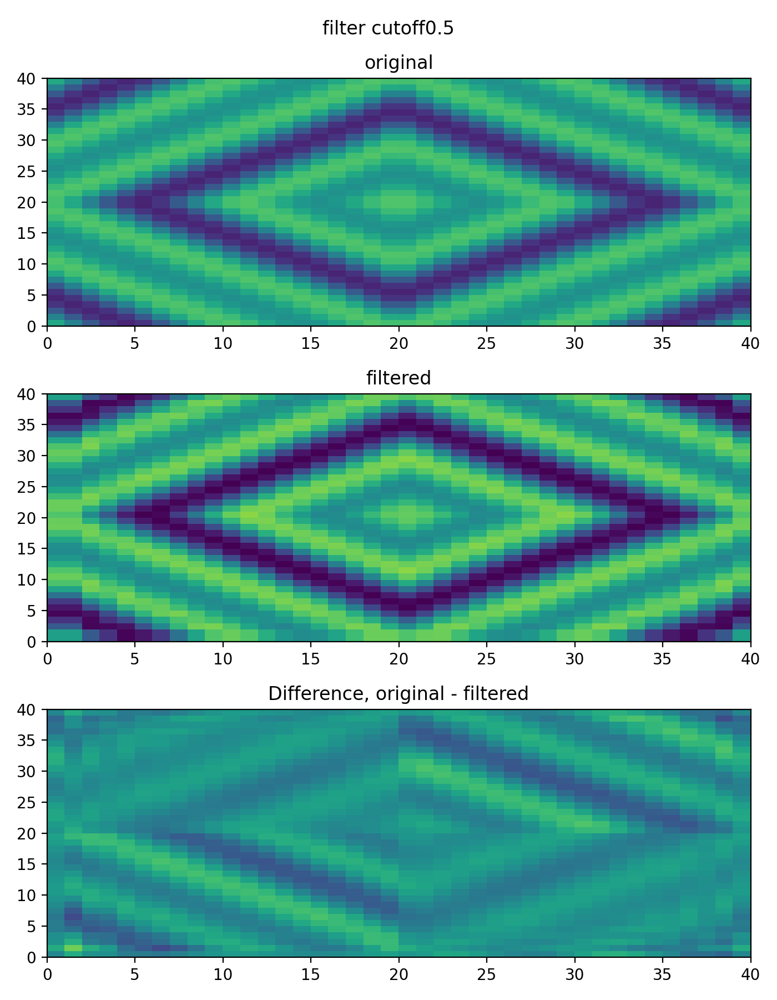
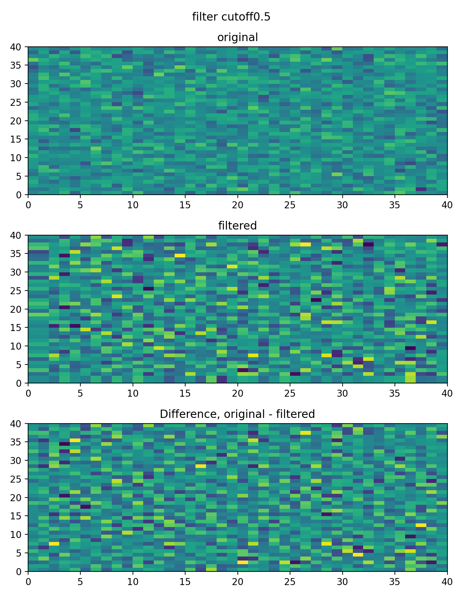
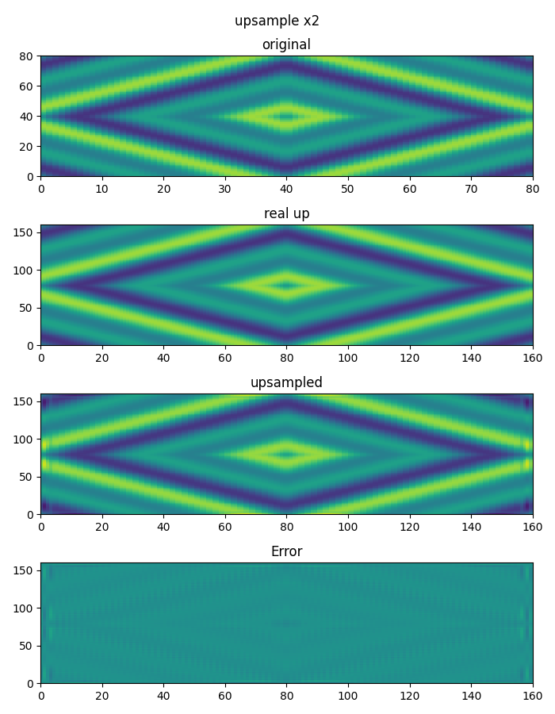
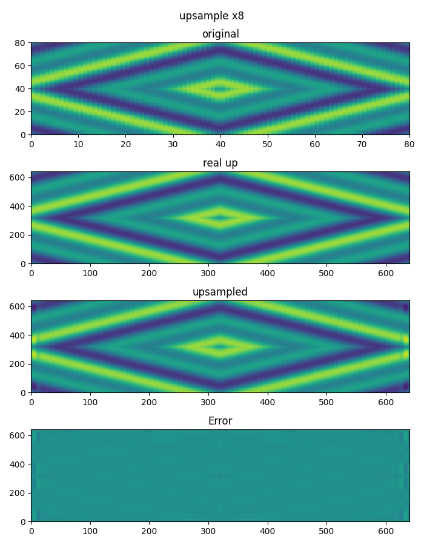
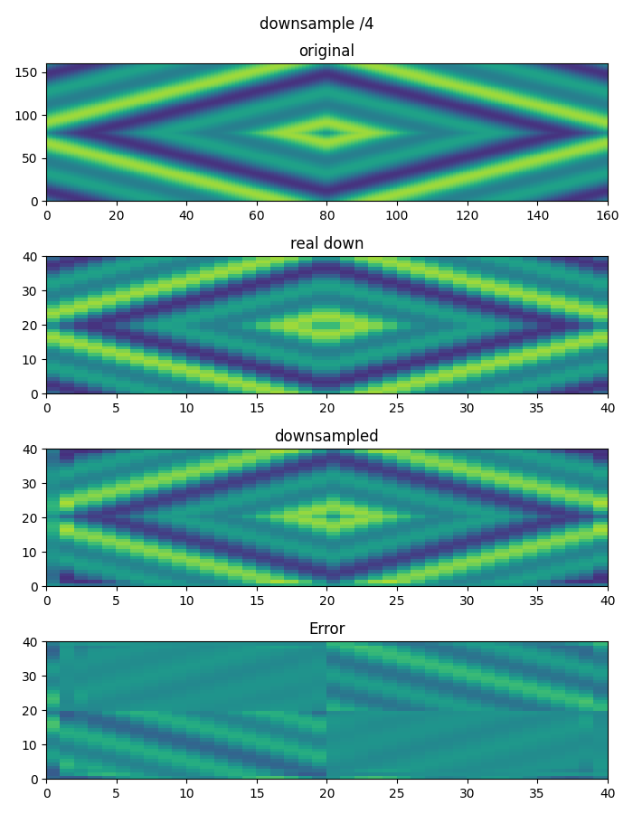

# Alias-Free-Torch

Simple torch module implementation of [Alias-Free GAN](https://nvlabs.github.io/alias-free-gan/).

This repository including
- Alias-Free GAN style lowpass sinc filter @[filter.py](/src/alias_free_torch/filter.py)

- Alias-Free GAN style up/downsample @[resample.py](/src/alias_free_torch/resample.py)

- Alias-Free activation @[act.py](/src/alias_free_torch/act.py)

- and test codes @[./test](/src/alias_free_torch/test)

**Note: Since this repository is unofficial, filter and upsample could be different with [official implementation](https://github.com/NVlabs/stylegan3).**

**Note: 2d lowpass filter is applying sinc instead of jinc (first order Bessel function of the first kind) in paper**

**UPDATE: You can download alias-free-torch from [pip](https://pypi.org/project/alias-free-torch/)**
```shell
python -m pip install alias-free-torch
```

## Requirements
Due to `torch.kaiser_window` and `torch.i0` are implemeted after `1.7.0`, our repository need `torch>=1.7.0`.
- Pytorch>=1.7.0

For custom torch users, `pip` will not check torch version.

## TODO
- [x] 2d sinc filter
- [x] 2d resample
- [x] devide 1d and 2d modules
- [x] pip packaging
- [x] rewrite upsample
- [x] apply jinc(torch.special.i1) with updated torch
- [ ] Upsample pad size issue
- [ ] support calculation for \[B,C,T/(H,W)\] (now only supports \[B,T/(H,W)\] or \[B,1,T/(H,W)\])
- [ ] set filter as register buffer
- [ ] provide loadable ckpt for lower version of torch
- [ ] documentation
## Test results 1d
| Filter sine              | Filter noise                  |
| --------------------- | --------------------------- |
|  |  |

| upsample              | downsample                  |
| --------------------- | --------------------------- |
|  |  |
|  |  |

## Test results 2d
| Filter L1 norm sine   | Filter noise                  |
| --------------------- | --------------------------- |
|  |  |

| upsample              | downsample                  |
| --------------------- | --------------------------- |
|  |  |
|  |  |

| Activation             |
| ---------------------    |
|  |


## References

- [Alias-Free GAN](https://nvlabs-fi-cdn.nvidia.com/alias-free-gan/alias-free-gan-paper.pdf)
- [adefossez](https://github.com/adefossez)/[julius](https://github.com/adefossez/julius)
- A. V. Oppenheim and R. W. Schafer. *Discrete-Time Signal Processing*. Pearson, International Edition, 3rd edition, 2010

## Acknowledgement

This work is done at [MINDsLab Inc](https://github.com/mindslab-ai).

Thanks to teammates at MINDsLab Inc.
- [Hyoungkyu Song](https://github.com/deepkyu)
- [Kang-wook Kim](https://github.com/wookladin)
- [Dongho Choi](https://github.com/dhchoi99)
- [Sang Hoon Woo](https://github.com/tonyswoo)

