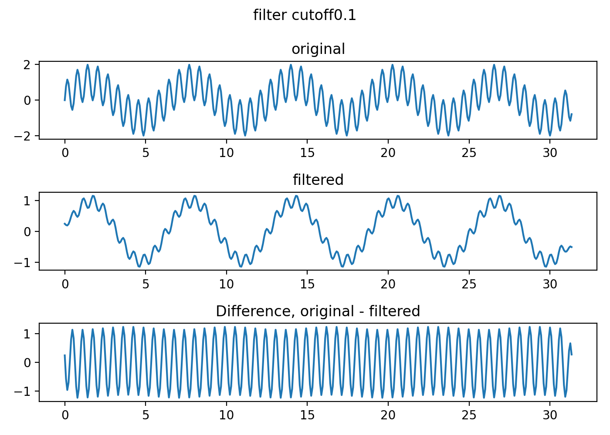
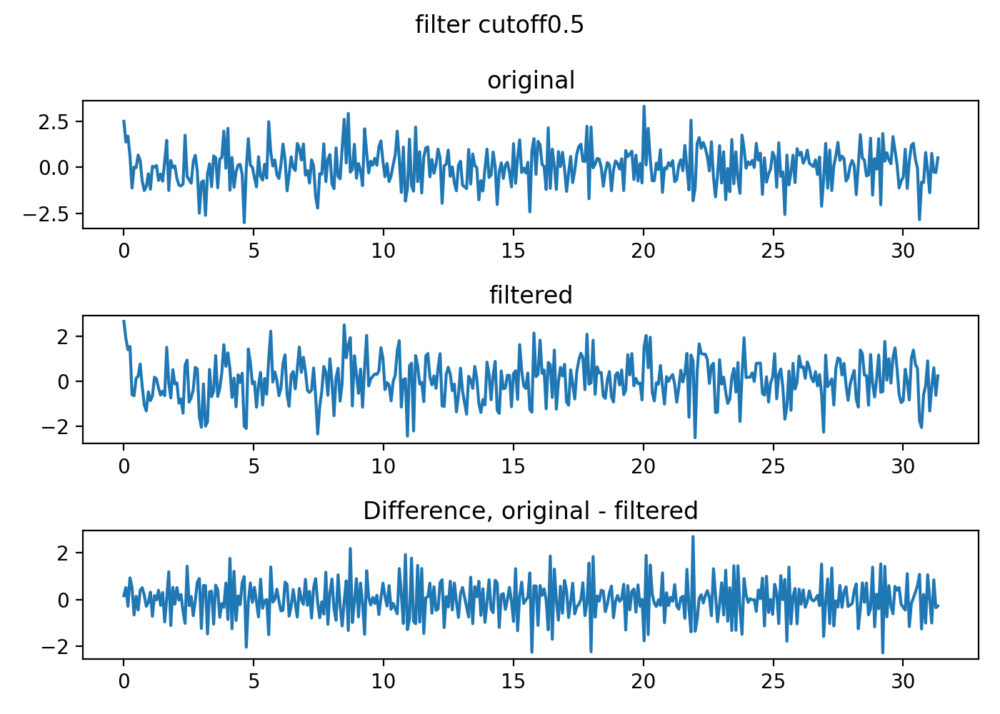
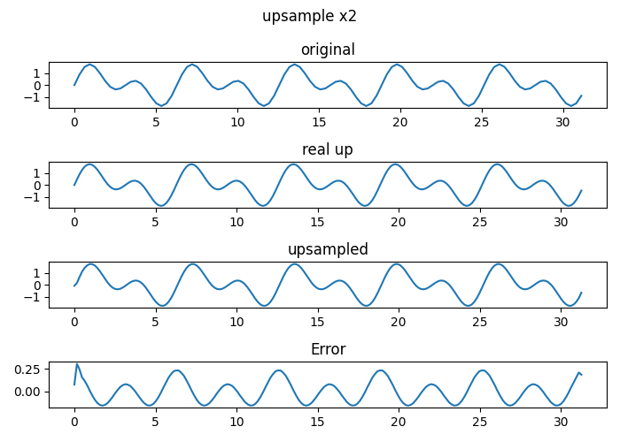
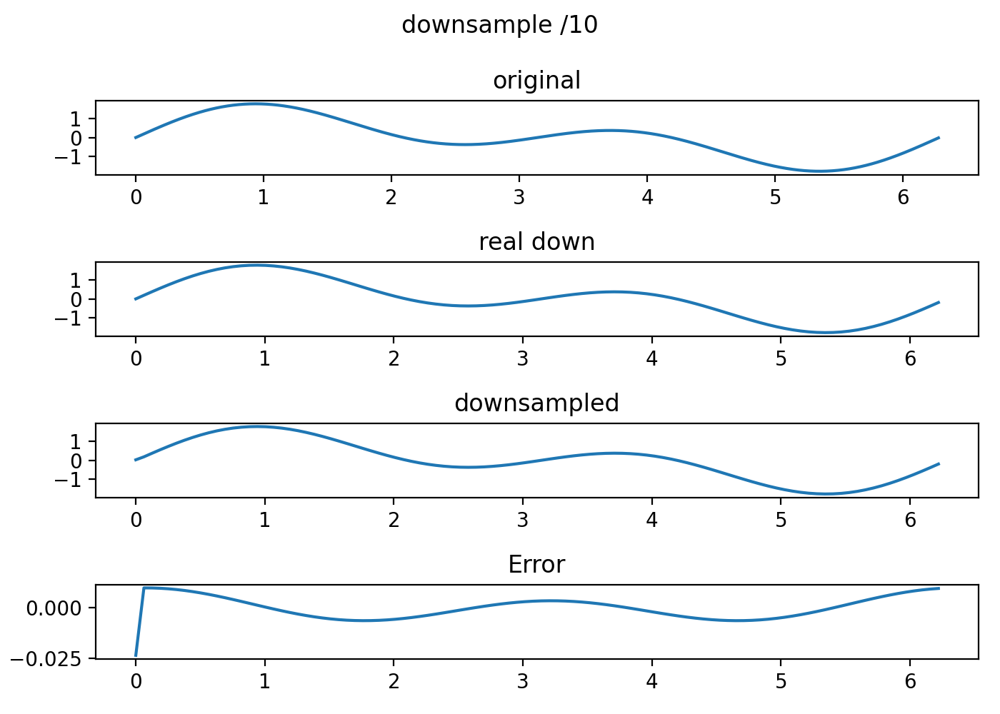
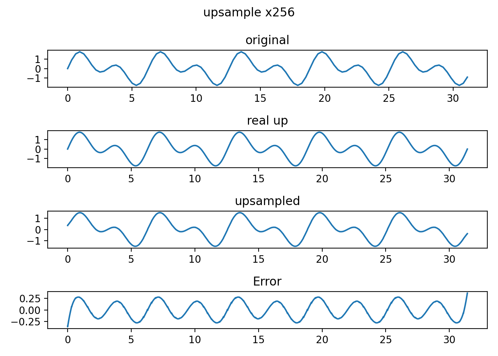
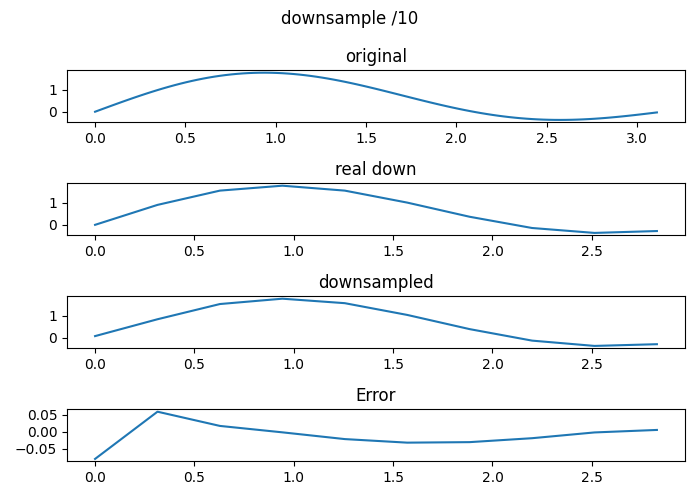

# Alias-Free-Torch

Simple torch module implementation of [Alias-Free GAN](https://nvlabs.github.io/alias-free-gan/).

This repository including
- Alias-Free GAN style lowpass sinc filter @[filter.py](/filter.py)

- Alias-Free GAN style up/downsample @[resample.py](/resample.py)

- Alias-Free activation @[act.py](/act.py)

- and test codes @[./test](/test)
- **Note: For  now, only 1d filter and resample are implemented**

## TODO
- [ ] 2d sinc filter
- [ ] 2d resample
- [ ] devide 1d and 2d modules

## Test results 
| Filter sine              | Filter noise                  |
| --------------------- | --------------------------- |
|  |  |

| upsample              | downsample                  |
| --------------------- | --------------------------- |
|  |  |
|  |  |

## References

- [Alias-Free GAN](https://nvlabs-fi-cdn.nvidia.com/alias-free-gan/alias-free-gan-paper.pdf)
- [adefossez](https://github.com/adefossez)/[julius](https://github.com/adefossez/julius)
- A. V. Oppenheim and R. W. Schafer. *Discrete-Time Signal Processing*. Pearson, International Edition, 3rd edition, 2010

## Acknowledgement

This work is done at [MINDsLab Inc](https://github.com/mindslab-ai).

Thanks to

- [Hyoungkyu Song](https://github.com/deepkyu)
- [Kang-wook Kim](https://github.com/wookladin)
- [Dongho Choi](https://github.com/dhchoi99)

